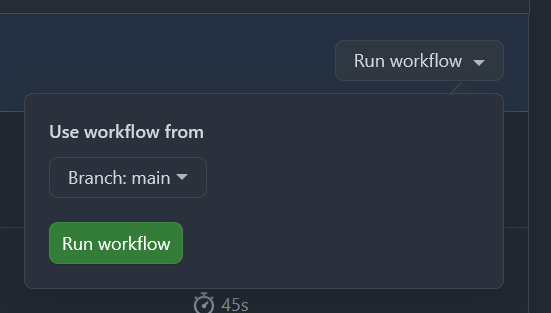

# How do I fetch changes from ThoughtSpot?

Once you have made changes to your DEV environment (read: org) in __ThoughtSpot__, how can you pull those changes into your Github `ts-dev` branch?

The [__Commit API__](https://developers.thoughtspot.com/docs/git-api#_commit_files) endpoint exports the TML files for the requested ThoughtSpot objects directly to a Git branch and commits the changes.

  1. Ensure your [__Commit Workflow File__](.github/workflows/commit.yml) has been configured with the correct environment variables.

  2. Then, [__visit the workflow__](https://github.com/thoughtspot/ts-ci-github/actions/workflows/commit.yml) and click the `Run Workflow` button.

  

      <figure>
          
          <figcaption><i>Manually trigger the Workflow</i></figcaption>
      </figure>
  

  3. Wait for the workflow to complete, then check your `ts-dev` branch to see the changes.
