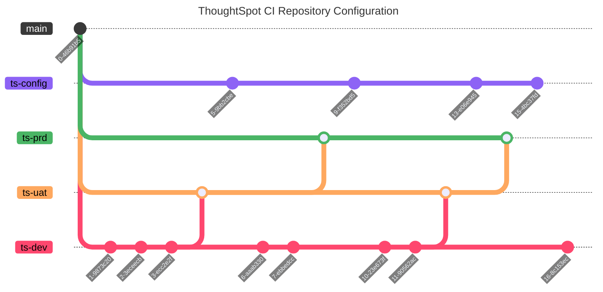

## How should I set up my GitHub Repository?

> *The __ThoughtSpot__ version control APIs work by linking a git branch to a __ThoughtSpot__ Org, [__using the configure Git integration REST API__](https://developers.thoughtspot.com/docs/git-configuration#_configure_git_repository).* 
>
>
> <b>Further reading <a href=https://developers.thoughtspot.com/docs/git-integration#_git_integration_overview>Git Integration Overview</a></b>

> [!IMPORTANT]
> __A paired Git branch and ThoughtSpot Org are called an environment.__

---

We __strongly__ recommend creating a new branch for each environment, and labeling each branch with a common prefix.

Additional branches may be created for non-environmental purposes (documentation, complementary ThoughtSpot code, etc..) however __you should never merge them__ into the environment branches.

It is recommended that you use the `ts-` prefix for all environment branches, and create a `ts-config` branch [__in order to automatically map guids between environments__](https://developers.thoughtspot.com/docs/git-configuration#guid-map-and-config-files). __ThoughtSpot__ will automatically make a commit to this branch on successful deployments.

For example, if we have `DEV`, `UAT`, and `PRD` environments, your branch strategy may look like..

---

### Where the only "manual" work happens in the ThoughtSpot Development environment (read: Org).

- Changes are moved from `ThoughtSpot -> DEV` __only__ through the [__Commit Workflow__](info/commit.md) process.
- Changes are moved from `DEV -> UAT` __only__ through the [__Pull Request__](info/deploy.md) process.
- Changes are moved from `UAT -> PRD` __only__ through the [__Pull Request__](info/deploy.md) process.

On acceptance and merge of the PR, changes are deployed to the __ThoughtSpot__ Org.

## How should I set up my ThoughtSpot?

- Go to Develop tab of Org for which you want to create __Config__
- In __Rest API__ Section, select [ __REST Playground v1__ ](https://try-everywhere.thoughtspot.cloud/v2/#/everywhere/api/rest/playgroundV2_0)
- In __API ENDPOINT__ section, select version control where we need to create a config file.
- Create a config for __Thoughtspot__ to login to __Github REPO__ where you want to do version control of __TS__ Objects.
- Provide the [__Parameters__](https://developers.thoughtspot.com/docs/git-configuration#_request_parameters)
- To get repository configuration information, select [__Search__ ](https://developers.thoughtspot.com/docs/git-configuration#_search_git_configuration)API 
